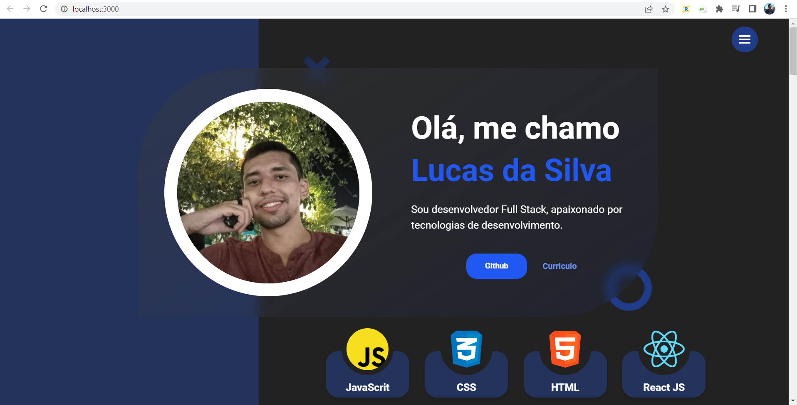

# Blog Pessoal. :computer:

- Tecnologias:

* Next js (SSR).
* Sass.
* Typescript.
* API RESTful (Consumindo a API do GIT).

- Páginas:

* Home (Single Page).



## Motivo.

Criar meu espaço na internet onde posso divulgar meus projetos e resultados de meus estudos individuais. Além disso, usa-ló como um cartão de boas-vindas para outras pessoas.

## Descrição:

O projeto foi executado com uma única página, desta forma, está dividido em 5 blocos. 

* Primeiro Bloco:

O primeiro bloco é responsável pela apresentação, por isso contém um breve texto de apresentação, imagem pessoal, link para github, download de currículo e as principais linguagens e tecnologias mais utilizadas.

Este bloco possui alguns componentes a fim de evitar repetição e codificação e diminuição do número de linhas de código.
O cartão flutuante que contém a imagem pessoal, o texto da apresentação, o link do github e o botão para retomar o download. Além disso, possui o componente para criação de minicartões tecnológicos.

- Nome dos componentes: 

AboutCard: <br/>

Criado para reduzir a quantidade de linhas de codigo.

SkillCards: <br/>

Possui três propriedades para modelar o SkillCard.

```markdown
{ name, src, tablet }
```

A tipagem dessas propriedades vem do arquivo SkillType.ts.

* Segundo Bloco: 

Esse bloco é um pouco mais complexo, pois contém todos os projetos feito. Os projetos são capturados usando a API do github.
